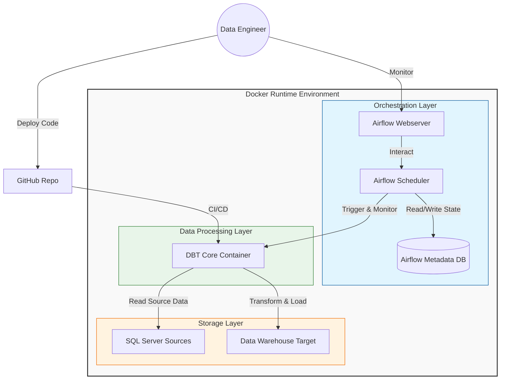

# System Architecture

## Overview

This project implements a modern DataOps pipeline designed to transform raw data into business-ready insights. The architecture follows a robust Extract, Load, Transform (ELT) pattern, leveraging containerization for consistency and scalability.

## Architecture Diagram

The following diagram illustrates the high-level architecture and data flow of the system:

## Data Flow

1.  **Ingestion & Staging (Bronze Layer)**:
    *   DBT connects to the source SQL Server database.
    *   Data is read from raw `AdventureWorks` tables.
    *   Basic cleaning and standardization rules are applied.
    *   Result: `staging_*` views/tables accessible in the warehouse.

2.  **Transformation (Silver Layer)**:
    *   DBT reads from the Bronze layer models.
    *   Business logic, filtering, and joins are applied (e.g., joining Orders with Customers).
    *   Result: Intermediate models representing business entities.

3.  **Mart Creation (Gold Layer)**:
    *   Aggregates and complex metrics are calculated from Silver models.
    *   Data is structured for specific analytic use cases (e.g., Sales Dashboard).
    *   Result: High-performance tables ready for consumption by BI tools.

## Key Components

### 1. Source System: SQL Server 2019
*   **Role**: Acts as the operational database containing raw business data (AdventureWorks).
*   **Deployment**: Runs in a Docker container alongside the pipeline.

### 2. Transformation Engine: DBT (Data Build Tool)
*   **Role**: Performs T (Transform) in ELT. Compiles SQL models and runs them against the target database.
*   **Key Features Used**:
    *   Modular Data Modeling (Bronze/Silver/Gold).
    *   Data Testing (Schema & Custom tests).
    *   Documentation generation.

### 3. Orchestration: Apache Airflow
*   **Role**: Manages the schedule and execution dependencies of the pipeline.
*   **Workflow**:
    *   Triggers DBT jobs on a defined schedule (e.g., daily).
    *   Retries failed tasks.
    *   Alerts on failure.

### 4. CI/CD: GitHub Actions
*   **Role**: Automates code quality checks and deployment.
*   **Pipeline**:
    *   **CI**: Lints SQL/Python code, runs DBT tests on Pull Requests.
    *   **CD**: Automatically runs the transformation pipeline upon merge to `main`.
